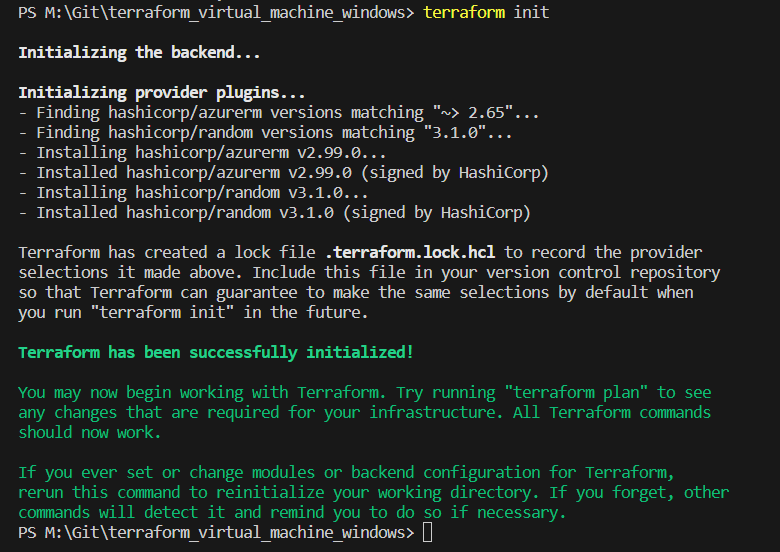

# Deployment of a Windows virtual machine on Azure using Terraform

This is the manual for the provisioning of a Windows virtual machine on Azure using Terraform.

# Prerequisites

Despite of having an *Azure* subscription, install following:

 - [Azure CLI](https://learn.microsoft.com/en-us/cli/azure/install-azure-cli)
 - [Terraform](https://developer.hashicorp.com/terraform/downloads)

# Sources for the Terraform configuration

I'd like to refer to following to links, which I've used for for that example:

[Hashicorp - azurerm - Windows Virtual Machine](https://registry.terraform.io/providers/hashicorp/azurerm/latest/docs/resources/windows_virtual_machine)

[Hashicorp - azurerm - public ip](https://registry.terraform.io/providers/hashicorp/azurerm/2.55.0/docs/resources/public_ip)

# Deployment of the Windows virtual machine

I recommend to conduct all commands in VS Code using a new Terminal.

## Login in to Azure

Run following command to start the login to *Azure*:

```
az login
```

A new browser session pops up, use the login credentials of your account:


After that, switch back to VS Code, you should see logs similar in the picture shown below:


You can prove whether you are using the right subscription using the following command:

```
az account show
```
This shows you the current subscription:


## Deployment of the virtual machine using Terraform

The first *Terraform* command is the "init" command:

```
terraform init
```
The logs in the picture below show a successful execution of the command:



As next, run the "format" command, to ensure that all files of your configuration stick to specific language style conventions:

```
terraform fmt
```

After that, ensure that your *Terraform* coniguration is valid by executing:

```
terraform validate
```


## Validation

Use the Validation command for verifying the file

```
terraform validation
```

## Apply

Use the Apply command for conducting the provisioning

```
terraform apply
```
